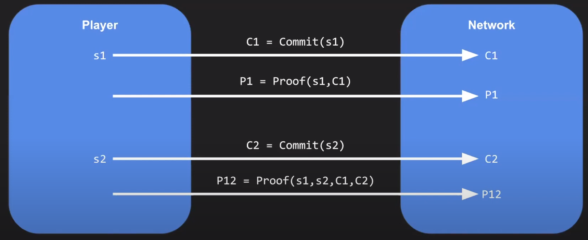

# DARK FOREST
Dark Forest is a fully decentralized and persistent RTS (real-time Strategy) game, where players make strategic decisions and manage resources and units in real time, similar to games like Age of Empires, StarCraft, and WarCraft.

Additionally, Dark Forest is an MMO (Massively Multiplayer Online) space-conquest game, where players discover and conquer planets in an infinite, procedurally-generated, cryptographically-specified universe. While the final Dark Forest universe will eventually be persistent, the first editions of the game will be timeboxed, and the beta universe will be refreshed regularly.

## Why is ZK useful in games?
Before we delve into the reasons, let's understand the distinction between Complete vs. Incomplete Information games. Games can be roughly categorized into two types: Complete Information games and Incomplete Information games.

**Complete Information**: These are games like checkers or chess, where every player knows the full state of the world at any given time. Each opponent can see the visible state of the game, and there are no secrets.

**Incomplete Information**: These are games like poker or real-time strategy games, where there is some notion of private state that not all players may know. For example, in poker, each player has their own hand state and cannot reveal it to others. No player knows what cards are in other players' hands.

**RTS games**: They are also known to be Incomplete Information games because they feature a mechanic called fog of war. This means that while players can see their own base in the game, they might not know where their opponents are or what they're doing if they don't have vision of the areas that their opponents occupy. For example, a player might not be aware of the specific units their opponents are producing or the location of all their units and armies relative to their own base.

**Open-world, persistent MMOs (EVE Online, Minecraft anarchy, etc.)**: These games also fall into the category of Incomplete Information games because not everybody knows everything about the state of the world. This information asymmetry allows for a much richer and more dynamic space of possible strategies and player interactions, such as deception, betrayal, and complex social dynamics.

Dark Forest, being an MMO with incomplete information, benefits from this setup in multiplayer settings.

Note: Unfortunately, due to the nature of decentralized systems, most blockchain games and settings are necessarily Complete Information games. This is because decentralized systems have a data layer that is completely open and transparent, allowing anyone to inspect the EVM (Ethereum Virtual Machine) at any point in time and determine the full contract state of any given decentralized app.

For example, Cryptokitties is a Complete Information game because it resembles a trading card game where everybody knows who owns what kitties and the properties of each kitty. Naively, it seems challenging to incorporate the notion of incomplete information into the blockchain simply because the data layer is completely open.

### Hidden Information on the Blockchain

From the recent advancements in zk Technology allow us to kind of  hack in the notion of hidden information or information asymmetry into a blockchain setting.

Let's get in how Zk snarks are useful take a look at this diagram.

With zk-SNARKs, players possess the capability to maintain a private state while still being able to commit a public commitment to this hidden private state onto the network without revealing the specific details of that hidden state. They achieve this by employing zero-knowledge proofs to operate on the hidden state.

1. On the left side, we have a player holding a secret private state **s1**. Instead of directly uploading their private state to the network on the right side, the player generates a public commitment. This commitment is created by hashing their private state, resulting in a public commitment **c1**, which is then broadcasted to the network.

3. In addition to the above public commitment, the player also includes a zero-knowledge proof to verify the validity of the commitment, ensuring it corresponds to a valid private state pre-image. This zero-knowledge proof demonstrates knowledge of the pre-image of the hash.

4. Whenever the player wants to transition from private state **s1** to private state **s2**, they must make a public commitment of the new private state to the network. To achieve this, they upload the hash of their new private state, along with a zero-knowledge proof demonstrating the existence of a valid state transition from the pre-image of their first commitment (s1) to the pre-image of their second commitment (s2).

5. Thus, the state transition from s1 to s2 is considered valid according to the rules of the game.

6. On the network side, neither private states s1 nor s2 are revealed. This concrete example illustrates the concept of a proof with incomplete information. Analogously, it is akin to a player claiming to move their knight from a secret location **'a'** to another secret location **'b'** without disclosing the actual values of **'a'** or **'b'**. Nevertheless, the zero-knowledge proof verifies that the movement indeed follows an **'L'** shape, without disclosing any additional underlying information about the exact locations of the piece.

